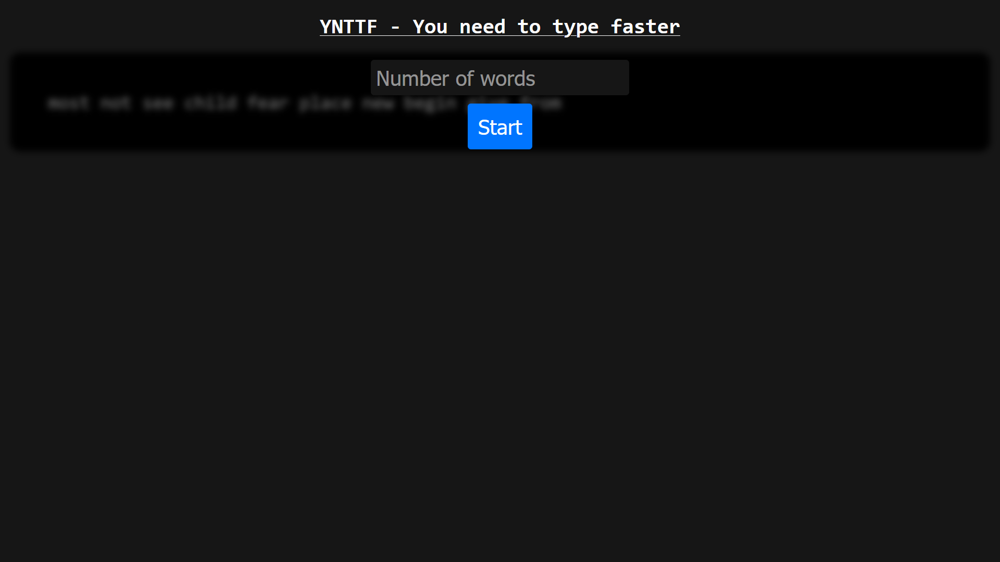
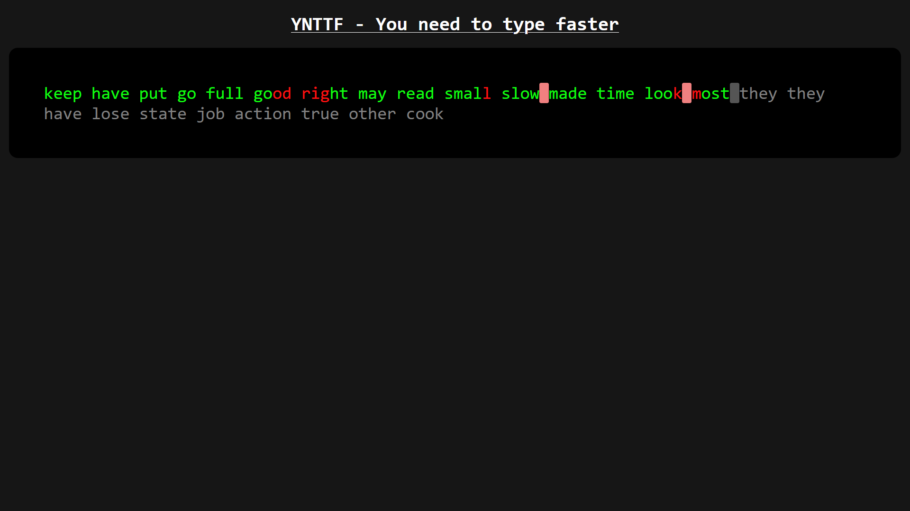
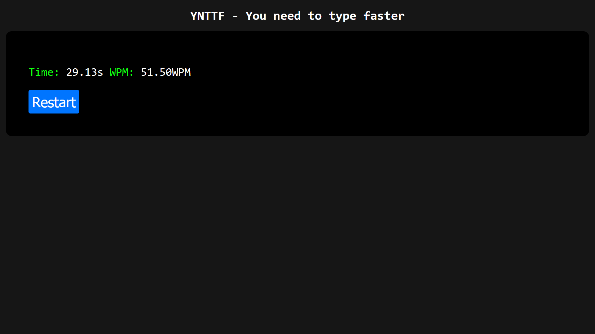

# YNTTF - You need to type faster
YNTTF is a 'game', which is about typing a given text as fast and as correct as you can. At the end you can see your WPM and the time you needed.
The project was made using HTML, JavaScript and CSS. It probably has a loooot of pretty bad code, but it was just a side project and the code works.

## Usage
### 1. Start
Once setup you'll be greeted with a screen looking like this:

Here you need the give the site the number of words you want to type. Then you need to press on the START button.

### 2. Typing
Now you can type the words once you reach the end you'll get to the end screen. 
If you type something wrong it will be highlighted in red.

### 3. End
Once you typed all of the words you can see your time and your WPM.

**Note: The number of WPM is calculated using the word count not how many words you typed correctly.**

